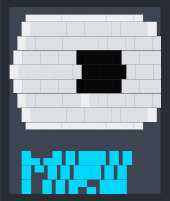

# Miru

<br>

<div align="center">
  
</div>

<br>
<br>

A Wayland-native screen magnifier and cursor spotlight tool for streamers, built
for [Niri](https://github.com/YaLTeR/niri). (Tested on `niri` so unless tested
in other WM's I cannot guarantee it'll work)

Inspired by [boomer](https://github.com/tsoding/boomer), but for Wayland —
written in C, keybind-driven, no GUI, no mouse-required config.

> **Status: early development.** Wayland connection, registry discovery,
> one-shot screen capture via `wlr-screencopy`, scale-aware rendering into a
> `wlr-layer-shell` overlay, and a working keybind-driven toggle (via
> `miructl` + a Unix socket) are all in place. Pressing the bound key freezes
> the screen; pressing it again returns to normal. There's no zoom/pan yet —
> the overlay is currently a static frozen screenshot, not a magnifier. See
> [Roadmap](#roadmap).

## What it does (planned)

Two toggleable modes, each bound to a Niri keybind:

- **Magnifier mode** — press a key, the screen freezes into a zoomed-in
  fullscreen view centered on your cursor. Move the mouse to pan, scroll or
  press keys to adjust zoom, press again (or Esc) to exit. Like `boomer`, but
  native Wayland. The freeze-on-toggle plumbing for this now works; zoom/pan
  itself is not implemented yet.
- **Spotlight mode** — a click-through overlay that darkens the whole screen
  except a soft-edged circle following your cursor, while you keep working
  normally underneath. Useful for drawing viewer attention during
  streams/recordings.

## Why

Most screen magnifiers either don't exist for Wayland, or route through XWayland
with visible artifacts and no compositor integration. Miru talks to Niri's own
protocols directly (`wlr-layer-shell`, `wlr-screencopy`) instead.

## Requirements

- A Wayland compositor implementing `wlr-layer-shell-unstable-v1` and
  `wlr-screencopy-unstable-v1` (developed against Niri)
- `wayland-client`, `wayland-protocols`, `wayland-scanner` (pacman: `wayland`,
  `wayland-protocols`)
- CMake ≥ 3.20, Ninja
- A C11 compiler

## Building

```bash
cmake -S . -B build -G Ninja -DCMAKE_EXPORT_COMPILE_COMMANDS=ON
cmake --build build
```

Or with [Grimoire](https://github.com/Vaishnav-Sabari-Girish/grimoire):

```bash
grim cast build
```

This builds two binaries: `miru-daemon` (the actual Wayland client) and
`miructl` (a tiny, Wayland-independent socket client used to control it).

## Running

Start the daemon first, in the foreground or via a systemd user service /
your compositor's `spawn-at-startup`:

```bash
./build/miru-daemon
# or
grim cast run-daemon
```

It connects to the compositor, logs every advertised protocol, opens a Unix
socket at `$XDG_RUNTIME_DIR/miru.sock`, and then idles — no overlay is shown
until told to toggle. Nothing else happens until a toggle command arrives.

Toggle the overlay on/off:

```bash
./build/miru-daemon --version   # prints version info + an ASCII logo, exits immediately
./build/miructl toggle          # freezes the screen / returns it to normal
./build/miructl quit            # tells the daemon to shut down
```

In practice you'll want this bound to a key rather than run manually. A Niri
keybind example:

> [!NOTE]
> Make sure to run this after running the daemon in a terminal or else it will
> not work

```kdl
Mod+Z hotkey-overlay-title="toggle miru" { spawn-sh "/path/to/miru/build/miructl toggle"; }
```

On toggle-on, the daemon captures one frame via `wlr-screencopy`, blits it
into a fullscreen `wlr-layer-shell` overlay (correctly scaled on HiDPI
outputs), and shows it — a real frozen snapshot of whatever was on screen at
that instant. On toggle-off, the surface is torn down and you're back to a
fully interactive desktop. There's deliberately no continuous re-capture
while the overlay is visible: an earlier version tried that and hit a
feedback loop where the overlay could end up capturing itself (e.g. during
Alt+Tab), so capture now only ever happens once per toggle-on, matching
`boomer`'s actual freeze-on-demand behavior rather than a live feed.

The overlay also currently blocks clicks to whatever's underneath (keyboard
input still passes through, which is how you can blindly run `miructl` from
a terminal hidden behind the overlay); that click-through gap is expected at
this stage and gets addressed once Spotlight mode sets an explicit empty
input region.

## Project structure

```text
.
├── CMakeLists.txt
├── cmake/
│   └── WaylandScanner.cmake   # wraps wayland-scanner as CMake custom commands
├── protocol/                  # vendored protocol XML (not shipped by wayland-protocols)
│   ├── wlr-layer-shell-unstable-v1.xml
│   └── wlr-screencopy-unstable-v1.xml
├── src/
│   ├── main.c                 # daemon entrypoint, IPC-driven toggle loop
│   ├── wayland_state.h/.c     # connection, registry, output scale, poll-based event loop
│   ├── layer_surface.h/.c     # fullscreen wlr-layer-shell overlay surface, blits capture in
│   ├── capture.h/.c           # one-shot screen capture via wlr-screencopy
│   ├── shm_buffer.h/.c        # shared-memory pixel buffer allocation helper
│   ├── ipc_server.h/.c        # Unix socket server, parses toggle/quit commands
│   ├── version.h.in           # CMake-configured version string (git describe)
│   └── logo.h                 # generated ASCII art for --version
├── ctl/
│   └── miructl.c              # thin socket client, no Wayland dependency
└── Grimoire.toml              # dev task runner (build/run/install/clean)
```

## Roadmap

- [x] Wayland connection, registry discovery, manual poll-based event loop
- [x] Fullscreen `wlr-layer-shell` overlay surface (solid color, no capture yet)
- [x] Screen capture via `wlr-screencopy` (verified working, not yet rendered)
- [x] Render the captured frame into the overlay surface (scale-aware, single
      output)
- [x] `miructl` control client + Unix socket IPC, daemon/client split
- [x] Keybind-driven toggle: capture + show on activate, tear down on
      deactivate, no continuous re-capture while visible
- [ ] Magnifier mode: zoom + pan around cursor on top of the existing toggle
- [ ] Spotlight mode: darken + feathered cursor cutout, click-through
- [ ] Cursor tracking for spotlight mode without stealing input (Niri IPC)
- [ ] Multi-monitor support, config file, smooth zoom animation

## License

See [LICENSE](./LICENSE).
