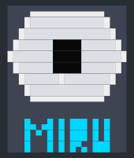
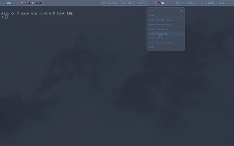

# Miru

<br>

<div align="center">
  
</div>

<br>
<br>

A Wayland-native screen magnifier and cursor spotlight tool for streamers, built
for Wayland compositors supporting the required wlroots protocols. Miru is
primarily developed and tested on Niri.

Inspired by [boomer](https://github.com/tsoding/boomer), but for Wayland —
written in C, keybind-driven, no GUI, no mouse-required config.

> **Status: early development.** Wayland connection, registry discovery,
> one-shot screen capture via `wlr-screencopy`, scale-aware rendering into a
> double-buffered `wlr-layer-shell` overlay, a working keybind-driven toggle
> (via `miructl` + a Unix socket), cursor-centered zoom/pan with
> keyboard/WASD/scroll-wheel controls, proper key-repeat, and TOML-based
> configuration are all in place. Spotlight mode isn't built yet.
> See [Roadmap](#roadmap).

> [!IMPORTANT]
> Miru currently requires both `wlr-layer-shell-unstable-v1` and
> `wlr-screencopy-unstable-v1`. Compositors that do not expose these protocols
> are not currently supported.
>
> In particular, **GNOME (Mutter)** and **KDE Plasma (KWin)** are not supported
> at this time.

> [!NOTE]
> `miru` devlogs on YouTube
> <https://youtube.com/playlist?list=PLZraydlsV2t0&si=jystH8Ik1UjDVu5t>

## Demo



### What it does

Two toggleable modes, each bound to a keybind on your compositor:

* **Magnifier mode** — press a key, the screen freezes into a zoomed-in
  fullscreen view centered on your cursor. Move the mouse to pan, scroll or
  press +/- to adjust zoom, use arrow keys or WASD to pan by keyboard, press
  Esc (or the toggle key again) to exit. Like `boomer`, but native Wayland.
  This is working end-to-end now.
* **Spotlight mode** — a click-through overlay that darkens the whole screen
  except a soft-edged circle following your cursor, while you keep working
  normally underneath. Useful for drawing viewer attention during
  streams/recordings. **Not built yet**.

### Why

Most screen magnifiers either don't exist for Wayland, or route through XWayland
with visible artifacts and no compositor integration. Miru uses Wayland
protocols directly, currently relying on `wlr-layer-shell` for its overlay and
`wlr-screencopy` for screen capture.

### A note on global hotkeys

Miru is toggled via a compositor-level keybind (see [Setting up a
keybind](#setting-up-a-keybind) below), not an in-app global hotkey — and
this is deliberate, not a missing feature. Wayland's security model doesn't
allow any client to listen for keypresses while it isn't focused; only the
compositor itself has that privileged access, which is exactly why every
Wayland compositor provides *some* way to bind a key to a command (a config
file, or a GUI).

Routing through the compositor is the correct, secure way to do this — the
alternative (a client reading raw kernel input events directly, bypassing
Wayland's input model) means running with elevated device permissions and
having the daemon read every keystroke on your system at all times just to
catch one hotkey, which is a meaningfully bigger trust ask than this project
wants to make for a screen-zoom tool.

### Requirements

* A Wayland compositor implementing `wlr-layer-shell-unstable-v1` and
  `wlr-screencopy-unstable-v1`
* `wayland-client`, `wayland-protocols`, `wayland-scanner` (pacman: `wayland`,
  `wayland-protocols`)
* CMake ≥ 3.20, Ninja (optional)
* A C11 compiler

#### Compositor compatibility

Miru currently requires a compositor that exposes both `wlr-layer-shell` and
`wlr-screencopy`.

* **Niri** — supported and used for development/testing
* **Sway** — supported by the required wlroots protocols
* **Mango** — supported if the required protocols are exposed
* **GNOME / Mutter** — not supported
* **KDE Plasma / KWin** — not supported

Support for compositors without these protocols may be added later through
alternative capture and overlay mechanisms.

### Installing

#### Arch Linux (AUR)

```bash
# latest tagged release
paru -S miru-zoom

# or track the latest commit on main
paru -S miru-zoom-git
```

Substitute your AUR helper of choice — `yay`, `paru`, or a manual
`makepkg -si` against the PKGBUILD.

#### Nix / NixOS

Run directly without installing:

```bash
nix run github:Vaishnav-Sabari-Girish/miru
```

Or install to your profile:

```bash
nix profile install github:Vaishnav-Sabari-Girish/miru
```

For development:

```bash
nix develop
```

#### Homebrew (Linuxbrew)

```bash
brew tap Vaishnav-Sabari-Girish/tap
brew install miru
```

#### From source

See [Building](#building) below.

### Building

```bash
# Using Ninja
cmake -S . -B build -G Ninja -DCMAKE_EXPORT_COMPILE_COMMANDS=ON

# Using Make
cmake -S . -B build -G "Unix Makefiles" -DCMAKE_EXPORT_COMPILE_COMMANDS=ON
```

Then run:

```bash
cmake --build build
```

Or with [Grimoire](https://github.com/Vaishnav-Sabari-Girish/grimoire):

```bash
grim cast build
```

This builds two binaries: `miru-daemon` (the actual Wayland client) and
`miructl` (a tiny, Wayland-independent socket client used to control it).

### Running

Start the daemon first, in the foreground or via a systemd user service /
your compositor's `spawn-at-startup`:

```bash
./build/miru-daemon

# or
grim cast run-daemon
```

It connects to the compositor, logs every advertised protocol, opens a Unix
socket at `$XDG_RUNTIME_DIR/miru.sock`, and then idles — no overlay is shown
until told to toggle. Nothing else happens until a toggle command arrives.

Toggle the overlay on/off:

```bash
./build/miru-daemon --version   # prints version info + an ASCII logo, exits immediately
./build/miructl toggle          # freezes + zooms the screen / returns it to normal
./build/miructl quit            # tells the daemon to shut down
```

### Configuration

Miru uses a TOML configuration file located at:

```text
$XDG_CONFIG_HOME/miru/config.toml
```

If `XDG_CONFIG_HOME` is not set, Miru follows the XDG fallback and uses:

```text
$HOME/.config/miru/config.toml
```

The directory and default configuration file are created automatically on
first launch.

The default configuration is:

```toml
[zoom]
factor = 2.0
increment = 0.25
max_factor = 10.0
smooth = false

[spotlight]
radius = 250
dim = 0.65
softness = 20

[general]
show_cursor = true
```

The currently active zoom options are:

* `factor` — initial zoom level. Must be at least `1.0`.
* `increment` — amount the zoom changes for each key or scroll input. Must be
  greater than `0`.
* `max_factor` — maximum zoom level. Must be at least `1.0`.

Invalid numeric values, including malformed, overflowing, non-finite, and
non-positive values where applicable, fall back to safe defaults. `factor` is
clamped to `max_factor` when necessary.

> [!NOTE]
> `zoom.smooth`, the `[spotlight]` settings, and `general.show_cursor` are
> currently parsed but do not have a runtime effect. They are reserved for
> functionality that has not been implemented yet.

Additional input and zoom diagnostics can be enabled by setting `MIRU_DEBUG` to
a non-zero value:

```bash
MIRU_DEBUG=1 ./build/miru-daemon
```

#### Setting up a keybind

You'll want this bound to a key rather than run manually. Each supported
compositor has its own way to bind a command to a key:

> [!NOTE]
> Make sure `miru-daemon` is already running before triggering the keybind,
> or `miructl` will fail with a connection error.

**Niri** — `~/.config/niri/config.kdl`:

```kdl
Mod+Z hotkey-overlay-title="toggle miru" { spawn-sh "/path/to/miru/build/miructl toggle"; }
```

***Hyprland** - `~/.config/hypr/hyprland.conf`

```config
bind = SUPER, Z, exec, /path/to/miru/build/miructl toggle
```

**Sway** — `~/.config/sway/config`:

```config
bindsym $mod+z exec /path/to/miru/build/miructl toggle
```

**Mango** — `~/.config/mango/config.conf`:

```conf
bind=SUPER,Z,spawn,/path/to/miru/build/miructl toggle
```

Substitute the actual path to your built `miructl` binary in each case (or
wherever it ends up if installed via a package manager).

On toggle-on, the daemon captures one frame via `wlr-screencopy`, blits it
into a fullscreen `wlr-layer-shell` overlay (correctly scaled on HiDPI
outputs, double-buffered to avoid tearing), and shows it at the configured
zoom factor, centered on your cursor. While active:

* **Move the mouse** to pan the zoomed view, tracking the cursor live
* **`+`/`-`** or **scroll wheel** to adjust the zoom level
* **Arrow keys or WASD** to pan by keyboard — press and hold for continuous
  panning at your keyboard's repeat rate
* **Esc**, or pressing the toggle keybind again, to exit back to your normal
  desktop

There's deliberately no continuous re-capture of the underlying screen while
the overlay is visible: an earlier version tried that and hit a feedback loop
where the overlay could end up capturing itself (e.g. during Alt+Tab), so the
frozen frame is captured once per toggle-on, matching `boomer`'s actual
freeze-on-demand behavior rather than a live feed. Zooming/panning within that
one frozen frame is fully live, however.

The overlay grabs keyboard and pointer input while active (needed for pan/zoom
to work), so clicks and most keys won't reach whatever's underneath until you
exit; that's expected for Magnifier mode. Spotlight mode, once built, will
behave differently — click-through by design.

### Project structure

```text
.
├── CMakeLists.txt
├── cmake/
│   └── WaylandScanner.cmake   # wraps wayland-scanner as CMake custom commands
├── protocol/                  # vendored protocol XML (not shipped by wayland-protocols)
│   ├── wlr-layer-shell-unstable-v1.xml
│   └── wlr-screencopy-unstable-v1.xml
├── src/
│   ├── main.c                 # daemon entrypoint, IPC-driven toggle loop
│   ├── wayland_state.h/.c     # connection, registry, seat/output tracking, poll-based event loop
│   ├── layer_surface.h/.c     # double-buffered wlr-layer-shell overlay, zoom/pan blit
│   ├── capture.h/.c           # one-shot screen capture via wlr-screencopy
│   ├── shm_buffer.h/.c        # shared-memory pixel buffer allocation helper
│   ├── ipc_server.h/.c        # Unix socket server, parses toggle/quit commands
│   ├── input.h/.c             # pointer/keyboard listeners: pan, zoom, key-repeat, Esc-to-exit
│   ├── config.h/.c            # config discovery, defaults, validation and loading
│   ├── toml.h/.c              # minimal TOML parser used by the config loader
│   ├── version.h.in           # CMake-configured version string (git describe)
│   ├── logo.h                 # ASCII logo module interface
│   └── logo.c                 # ASCII logo data and printing implementation
├── ctl/
│   └── miructl.c              # thin socket client, no Wayland dependency
└── Grimoire.toml              # dev task runner (build/run/install/clean)
```

### Roadmap

* [x] Wayland connection, registry discovery, manual poll-based event loop
* [x] Fullscreen `wlr-layer-shell` overlay surface (solid color, no capture yet)
* [x] Screen capture via `wlr-screencopy`
* [x] Render the captured frame into the overlay surface (scale-aware, single
  output)
* [x] `miructl` control client + Unix socket IPC, daemon/client split
* [x] Keybind-driven toggle: capture + show on activate, tear down on
  deactivate, no continuous re-capture while visible
* [x] Magnifier mode: cursor-centered zoom + live pan, mouse/keyboard/WASD/
  scroll zoom controls, proper multi-key repeat, double-buffered rendering
* [x] TOML configuration with XDG config directory support and configurable
  zoom behavior
* [ ] Spotlight mode: darken + feathered cursor cutout, click-through
* [ ] Cursor tracking for spotlight mode without stealing input (Niri IPC)
* [ ] Multi-monitor support
* [ ] Smooth zoom animation
* [ ] Support compositors without `wlr-screencopy` / `wlr-layer-shell`

### License

See [LICENSE](./LICENSE).

## 🧠 (mostly) Brain made

**This project was NOT vibe-coded BUT AI is still involved in some parts of
it.**

* **Micro-improvements:** I have used AI as an advisor to improve some bits of
  code here and there. Big refactors or new features are done by my hand though.

<br>


