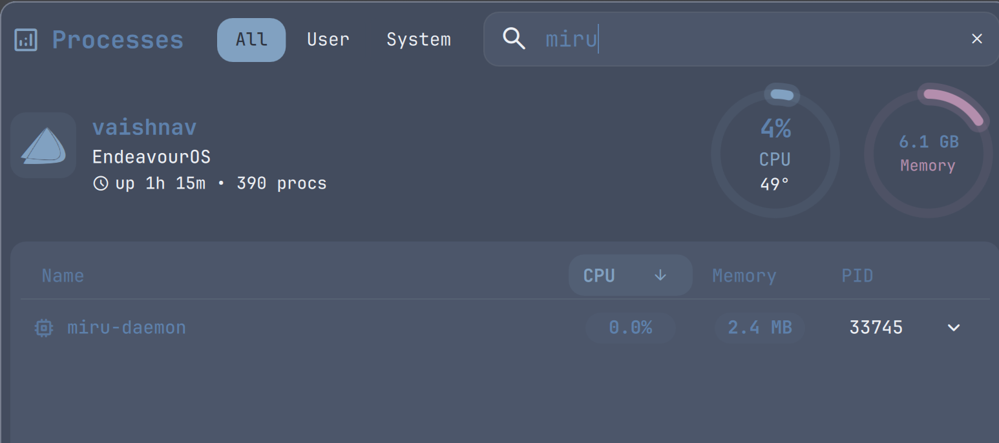

# Miru

<br>
<div align="center">
  
</div>
<br>
<br>

> [!IMPORTANT]
> Development is done on
> [Codeberg](https://codeberg.org/Vaishnav-Sabari-Girish/miru) with a mirror in
> [GitHub](https://github.com/Vaishnav-Sabari-Girish/miru)

A Wayland-native screen magnifier and cursor spotlight tool for streamers, built
for Wayland compositors supporting the required wlroots protocols. Miru is
primarily developed and tested on Niri.

Inspired by [boomer](https://github.com/tsoding/boomer), but for Wayland —
written in C, keybind-driven, no GUI, no mouse-required config.

See [Roadmap](#roadmap) for the full picture.

> [!IMPORTANT]
> Miru currently requires both `wlr-layer-shell-unstable-v1` and
> `wlr-screencopy-unstable-v1`. Compositors that do not expose these protocols
> are not currently supported.
>
> In particular, **GNOME (Mutter)** and **KDE Plasma (KWin)** are not supported
> at this time.

> [!NOTE]
> `miru` devlogs on YouTube
> <https://youtube.com/playlist?list=PLZraydlsV2t0&si=jystH8Ik1UjDVu5t>

## Demo

[](https://youtu.be/tRdhZG-Wgw0)

## Table of contents

* [What it does](#what-it-does)
* [Why](#why)
* [Performance](#performance)
* [A note on global hotkeys](#a-note-on-global-hotkeys)
* [Requirements](#requirements)
* [Installing](#installing)
* [Building](#building)
* [Running](#running)
* [Man pages](#man-pages)
* [Configuration](#configuration)
* [Project structure](#project-structure)
* [Roadmap](#roadmap)
* [Similar tools](#similar-tools)
* [License](#license)

### What it does

Two distinct features — one built, one planned. They share a visual
similarity (dim + soft-edged circle around the cursor) but are not the same
feature, and it's worth being clear about which one you're getting:

* **Magnifier mode** — press a key, the screen freezes into a zoomed-in
  fullscreen view centered on your cursor (or the last known pointer position
  from a previous session in the same daemon run). Move the mouse to pan,
  scroll or press +/- to adjust zoom, use arrow keys or WASD to pan by
  keyboard, press Esc (or the toggle key again) to exit. Like `boomer`, but
  native Wayland.

  While active:

  * **Tab** toggles **Cursor Highlight** — darkening everything except a
    soft-edged circle that follows the real pointer (absolute tracking), even
    when zoomed. Configurable via `[spotlight]`. Radius can be adjusted live
    with **Shift+Plus/Minus** or **Ctrl+scroll**. Entry/exit of the highlight
    is animated (`spotlight.animation_speed`).
  * **Shift+A** toggles **Annotate mode** — pan freezes and you can draw
    presentation shapes on the frozen frame (arrows and rectangles). See
    controls below.
  * **Shift+H** or **?** toggles an on-screen **help panel** listing the
    current keybinds (Esc closes help first, then exits the magnifier).

  Cursor Highlight, annotations, and help only work *inside* an active
  Magnifier session; the desktop underneath stays frozen/grabbed while the
  overlay is on. **Built and working now.**

* **Spotlight mode** — a fully independent, click-through overlay that
  darkens the whole screen except a cursor-tracking circle, while you keep
  working normally underneath — no freeze, no input grab, usable during
  normal desktop work rather than only inside a Magnifier session. This is a
  different, harder problem than Cursor Highlight above: it needs cursor
  tracking without stealing pointer/keyboard focus, which Cursor Highlight
  sidesteps entirely by already owning input while Magnifier is active.
  **Not built yet.**

### Why

Most screen magnifiers either don't exist for Wayland, or route through XWayland
with visible artifacts and no compositor integration. Miru uses Wayland
protocols directly, currently relying on `wlr-layer-shell` for its overlay and
`wlr-screencopy` for screen capture. The overlay itself is rendered with
OpenGL ES 2 via EGL.

### Performance

Because there's no continuous re-capture while the overlay is inactive (see
[Setting up a keybind](#setting-up-a-keybind) below for why), `miru-daemon`
sits completely idle — blocked in `poll()` waiting for either a Wayland event
or a toggle command — for as long as you're not actively using it. In
practice this means ~0% CPU usage at rest:

<div align="center">
  
</div>

### A note on global hotkeys

Miru is toggled via a compositor-level keybind (see [Setting up a
keybind](#setting-up-a-keybind) below), not an in-app global hotkey — and
this is deliberate, not a missing feature. Wayland's security model doesn't
allow any client to listen for keypresses while it isn't focused; only the
compositor itself has that privileged access, which is exactly why every
Wayland compositor provides *some* way to bind a key to a command (a config
file, or a GUI).

Routing through the compositor is the correct, secure way to do this — the
alternative (a client reading raw kernel input events directly, bypassing
Wayland's input model) means running with elevated device permissions and
having the daemon read every keystroke on your system at all times just to
catch one hotkey, which is a meaningfully bigger trust ask than this project
wants to make for a screen-zoom tool.

### Requirements

* A Wayland compositor implementing `wlr-layer-shell-unstable-v1` and
  `wlr-screencopy-unstable-v1`
* `wayland-client`, `wayland-protocols`, `wayland-scanner` (pacman: `wayland`,
  `wayland-protocols`)
* EGL + OpenGL ES 2 development packages
* CMake ≥ 3.20, Ninja (optional)
* A C11 compiler

#### Compositor compatibility

Miru currently requires a compositor that exposes both `wlr-layer-shell` and
`wlr-screencopy`.

* **Niri** — supported and used for development/testing
* **Sway** — supported; both required protocols are core to the wlroots
  ecosystem Sway is built on
* **Hyprland** — supported by the required wlroots protocols
* **Mango** — supported if the required protocols are exposed
* **Nauka** — supported and tested by
  [@shadowash8](https://github.com/shadowash8)
  (<https://github.com/shadowash8/nauka>)
* **GNOME / Mutter** — not supported
* **KDE Plasma / KWin** — not supported

Support for compositors without these protocols may be added later through
alternative capture and overlay mechanisms.

### Installing

#### Arch Linux (AUR)

```bash
# latest tagged release
paru -S miru-zoom
# or track the latest commit on main
paru -S miru-zoom-git

```

Substitute your AUR helper of choice — `yay`, `paru`, or a manual
`makepkg -si` against the PKGBUILD.

#### Nix / NixOS

Miru is packaged in
[nixpkgs](https://search.nixos.org/packages?channel=unstable&query=miru&show=miru)
(attribute `miru`). Prefer that over the project flake when you want a normal
channel/package install.

> [!NOTE]
> The nixpkgs package is maintained by
> [@yvnth](https://github.com/yvnth) — thank you!
> Releases in nixpkgs can lag behind upstream (Codeberg/GitHub tags). For the
> absolute latest commit, build from source or use the development flake below.

**Run without installing** (unstable channel):

```bash
nix shell nixpkgs/nixos-unstable#miru -c miru-daemon
# control client from the same package:
nix shell nixpkgs/nixos-unstable#miru -c miructl toggle
```

Classic `nix-shell`:

```bash
nix-shell -p miru -I nixpkgs=channel:nixos-unstable --run miru-daemon
```

**Install to your user profile:**

```bash
nix profile install nixpkgs/nixos-unstable#miru
# or: nix-env -iA nixpkgs.miru -f channel:nixos-unstable
```

**NixOS** — if your system follows unstable:

```nix
environment.systemPackages = with pkgs; [
  miru
];
```

On stable, pull only this package from unstable:

```nix
{ config, pkgs, ... }:
let
  unstable = import <nixos-unstable> { config = config.nixpkgs.config; };
in
{
  environment.systemPackages = [ unstable.miru ];
}
```

```bash
sudo nix-channel --add https://nixos.org/channels/nixos-unstable nixos-unstable
sudo nix-channel --update
```

**Development / bleeding edge** (optional project flake):

```bash
nix run git+https://codeberg.org/Vaishnav-Sabari-Girish/miru
nix develop git+https://codeberg.org/Vaishnav-Sabari-Girish/miru
```

#### Homebrew (Linuxbrew)

```bash
brew tap Vaishnav-Sabari-Girish/tap
brew install miru
```

#### From source

See [Building](#building) below.

### Building

```bash
# Using Ninja
cmake -S . -B build -G Ninja -DCMAKE_EXPORT_COMPILE_COMMANDS=ON
# Using Make
cmake -S . -B build -G "Unix Makefiles" -DCMAKE_EXPORT_COMPILE_COMMANDS=ON
```

Then run:

```bash
cmake --build build
```

Or with [Grimoire](https://github.com/Vaishnav-Sabari-Girish/grimoire):

```bash
grim cast build # Uses make to build by default
```

This builds two binaries: `miru-daemon` (the actual Wayland client) and
`miructl` (a tiny, Wayland-independent socket client used to control it).

#### Installing the built binaries

To install `miru-daemon` and `miructl` to `~/.local/bin`:

```bash
cmake --install build
```

Or with Grimoire, which also configures `CMAKE_INSTALL_PREFIX` for you:

```bash
grim cast install
```

### Running

You can run `miru-daemon` directly in the foreground, or set it up as a
systemd user service so it starts automatically with your graphical session.

#### Running directly

```bash
./build/miru-daemon
# or
grim cast run-daemon
```

#### As a systemd user service

Create `~/.config/systemd/user/miru.service`:

```systemd
[Unit]
Description=Miru Zooming Daemon
PartOf=graphical-session.target
After=graphical-session.target
ConditionEnvironment=WAYLAND_DISPLAY
ConditionPathExists=%h/.local/bin/miru-daemon

[Service]
ExecStart=%h/.local/bin/miru-daemon
Restart=on-failure
RestartSec=1

[Install]
WantedBy=graphical-session.target
```

This assumes `miru-daemon` has been installed to `~/.local/bin` (see
[Installing the built binaries](#installing-the-built-binaries) above) — adjust
`ExecStart`/`ConditionPathExists` if yours lives elsewhere.

Then enable and start it:

```bash
systemctl --user enable --now miru.service
```

Either way, once running, `miru-daemon` connects to the compositor, logs
every advertised protocol, opens a Unix socket at
`$XDG_RUNTIME_DIR/miru.sock`, and then idles — no overlay is shown until told
to toggle. Nothing else happens until a toggle command arrives (see
[Performance](#performance) above for what that idling actually costs).

Toggle the overlay on/off:

```bash
./build/miru-daemon --version # prints version info + an ASCII logo, exits immediately
./build/miructl toggle        # freezes + zooms the screen / returns it to normal
./build/miructl quit          # tells the daemon to shut down
```

### Man pages

`miru-daemon` and `miructl` each have their own `man` page. How you access
them depends on how you installed Miru:

* **Installed via `miru-zoom-git` (AUR), `cmake --install build`, or
  `grim cast build`/`grim cast install`** — no extra step, `man miru-daemon`
  and `man miructl` work immediately.
* **Homebrew** — not wired up yet, coming soon.
* **Built from source but not installed to `$PATH`** — point `man` at the
  page directly from the repo root:

```bash
man ./miru-daemon.1
man ./miructl.1
```

### Configuration

Miru uses a TOML configuration file located at:

```text
$XDG_CONFIG_HOME/miru/config.toml
```

If `XDG_CONFIG_HOME` is not set, Miru follows the XDG fallback and uses:

```text
$HOME/.config/miru/config.toml
```

The directory and default configuration file are created automatically on
first launch.

The default configuration is:

```toml
[zoom]
factor = 2.0
increment = 0.25
max_factor = 10.0
smooth = false

[spotlight]
radius = 250
dim = 0.65
softness = 20
animation_speed = 14.0
radius_step = 20.0

[general]
show_cursor = true
```

The currently active options are:

* `zoom.factor` — initial zoom level applied on each toggle-on. Must be at
  least `1.0`.
* `zoom.increment` — amount the zoom changes per key/scroll input. Must be
  greater than `0`.
* `zoom.max_factor` — maximum zoom level. Must be at least `1.0`.
* `zoom.smooth` — when `true`, zoom level and pan position are smoothly
  interpolated toward their targets instead of snapping.
* `spotlight.radius` — radius, in pixels, of the fully-bright circle around
  the cursor.
* `spotlight.dim` — how much darker the dimmed area gets, from `0.0` (no
  effect) to `1.0` (fully black).
* `spotlight.softness` — width, in pixels, of the feathered transition
  between the bright circle and the dimmed area.
* `spotlight.animation_speed` — how quickly Cursor Highlight radius/dim ease
  in and out when toggling Tab. Higher is faster.
* `spotlight.radius_step` — step size when adjusting the highlight radius
  with Shift+Plus/Minus or Ctrl+scroll.
* `general.show_cursor` — when `false`, hides the hardware cursor while the
  overlay is active (restoring a themed cursor when turning it back on may
  be limited depending on the compositor).

Invalid numeric values, including malformed, overflowing, non-finite, and
non-positive values where applicable, fall back to safe defaults. `zoom.factor`
is clamped to `zoom.max_factor` when necessary.

> [!NOTE]
> `[spotlight]` values are live — they control the Cursor Highlight effect
> toggled with Tab while Magnifier mode is active. They're named `[spotlight]`
> in the config because they'll be shared with standalone Spotlight mode once
> that's built, not because Cursor Highlight and Spotlight mode are the same
> feature.

The config file is watched while `miru-daemon` is running — saving changes
takes effect immediately, no restart needed. `zoom.max_factor`, `zoom.smooth`
and every `[spotlight]` value update live, including on an already-active
overlay; `zoom.factor` (the *initial* zoom on toggle-on) takes effect starting
with the next toggle, since retroactively snapping an in-progress session to a
different zoom level would be jarring rather than useful.

Additional input, zoom and texture-upload diagnostics can be enabled by
setting `MIRU_DEBUG` to a non-zero value:

```bash
MIRU_DEBUG=1 ./build/miru-daemon
```

#### Setting up a keybind

You'll want this bound to a key rather than run manually. Each supported
compositor has its own way to bind a command to a key:

> [!NOTE]
> Make sure `miru-daemon` is already running before triggering the keybind,
> or `miructl` will fail with a connection error.

**Niri** — `~/.config/niri/config.kdl`:

```kdl
Mod+Z hotkey-overlay-title="toggle miru" { spawn-sh "/path/to/miru/build/miructl toggle"; }
```

**Hyprland** — `~/.config/hypr/hyprland.lua`:

```lua
hl.bind("SUPER + Z", hl.dsp.exec_cmd("/path/to/miru/build/miructl toggle"))
```

**Sway** — `~/.config/sway/config`:

```config
bindsym $mod+z exec /path/to/miru/build/miructl toggle
```

**Mango** — `~/.config/mango/config.conf`:

```conf
bind=SUPER,Z,spawn,/path/to/miru/build/miructl toggle
```

**Nauka** — `~/.config/nauka/nauka.con`:

```conf
keybind super z run "/path/to/miru/build/miructl toggle"
```

Substitute the actual path to your built `miructl` binary in each case (or
wherever it ends up if installed via a package manager).

On toggle-on, the daemon captures one frame via `wlr-screencopy`, uploads it
as an OpenGL ES texture, and shows it in a fullscreen `wlr-layer-shell`
overlay (correctly scaled on HiDPI outputs) at the configured zoom factor,
centered on your cursor when possible. While active:

* **Move the mouse** to pan the zoomed view
* **`+`/`-`** or **scroll wheel** to adjust the zoom level
* **Shift+Plus / Shift+Minus** or **Ctrl+scroll** to adjust Cursor Highlight
  radius (while highlight is relevant / available)
* **Arrow keys or WASD** to pan by keyboard — press and hold for continuous
  panning at your keyboard's repeat rate
* **Tab** to toggle Cursor Highlight on/off — darkens everything except a
  soft-edged circle that follows the real pointer position across the
  screen (absolute tracking), using the `[spotlight]` config values. This
  is separate from the standalone Spotlight mode described above; see
  [What it does](#what-it-does) for the distinction.
* **Shift+A** to toggle **Annotate mode** (orange frame, pan frozen):
  * **W** — arrow tool
  * **R** — rectangle tool
  * **Left-click drag** — place the current tool on the frozen frame
  * **T** - text tool
  * **Click + type** - start typing text from the clicked location (indicated by
    a `_`)
  * **C** — clear all annotations
  * **Shift+A** again — leave annotate mode (shapes remain until overlay exit
    or clear)
* **Shift+H** or **?** — toggle the **help panel** (keybind cheat sheet).
  **Esc** closes help if it is open; otherwise Esc exits the magnifier.
* **Esc**, or pressing the toggle keybind again, to exit back to your normal
  desktop

There's deliberately no continuous re-capture of the underlying screen while
the overlay is visible: an earlier version tried that and hit a feedback loop
where the overlay could end up capturing itself (e.g. during Alt+Tab), so the
frozen frame is captured once per toggle-on, matching `boomer`'s actual
freeze-on-demand behavior rather than a live feed. Zooming/panning/Cursor
Highlight/annotations within that one frozen frame is fully live, however.

The overlay grabs keyboard and pointer input while active (needed for
pan/zoom/Cursor Highlight/annotate to work), so clicks and most keys won't
reach whatever's underneath until you exit; that's expected for Magnifier
mode. A future standalone Spotlight mode would behave differently —
click-through by design, see [What it does](#what-it-does) above.

> [!NOTE]
> **Cursor position on open:** Wayland does not expose a global pointer
> position while Miru is inactive. The view starts at the last pointer
> position from a previous overlay session in the same daemon process when
> available; otherwise it may open near the center until the first
> pointer-enter/motion. Running `miru-daemon` as a long-lived service helps
> retain that last position across toggles, but does not track the cursor
> while the overlay is off.

### Project structure

```text
.
├── CMakeLists.txt
├── cmake/
│   └── WaylandScanner.cmake          # wraps wayland-scanner as CMake custom commands
├── protocol/                         # vendored protocol XML (not shipped by wayland-protocols)
│   ├── wlr-layer-shell-unstable-v1.xml
│   └── wlr-screencopy-unstable-v1.xml
├── src/
│   ├── main.c                        # daemon entrypoint, IPC-driven toggle loop
│   ├── wayland_state.h/.c            # connection, registry, seat/output tracking, poll-based event loop
│   ├── layer_surface.h/.c            # wlr-layer-shell overlay, zoom/pan, Cursor Highlight, GL draw
│   ├── annotations.h/.c              # shape annotation state (arrow/rect), screen↔buffer mapping
│   ├── help.h/.c                     # help panel copy (keybind list)
│   ├── font8x8_basic.h               # public-domain 8x8 bitmap font for the help panel
│   ├── capture.h/.c                  # one-shot screen capture via wlr-screencopy
│   ├── shm_buffer.h/.c               # shared-memory pixel buffer allocation helper
│   ├── egl_context.h/.c              # EGL display / context / window-surface setup
│   ├── gl_renderer.h/.c              # OpenGL ES 2 shaders, texture upload, spotlight, annotations, help
│   ├── ipc_server.h/.c               # Unix socket server, parses toggle/quit commands
│   ├── input.h/.c                    # pointer/keyboard: pan, zoom, Tab, annotate, help, key-repeat, Esc
│   ├── config.h/.c                   # config discovery, defaults, validation and loading
│   ├── config_watch.h/.c             # inotify-based watch on the config directory, drives hot-reload
│   ├── toml.h/.c                     # minimal TOML parser used by the config loader
│   ├── version.h.in                  # CMake-configured version string (git describe)
│   ├── logo.h                        # ASCII logo module interface
│   └── logo.c                        # ASCII logo data and printing implementation
├── ctl/
│   └── miructl.c                     # thin socket client, no Wayland dependency
└── Grimoire.toml                     # dev task runner (build/run/install/clean)
```

### Roadmap

* [x] Wayland connection, registry discovery, manual poll-based event loop
* [x] Fullscreen `wlr-layer-shell` overlay surface
* [x] Screen capture via `wlr-screencopy`
* [x] Render the captured frame into the overlay (OpenGL ES + EGL, scale-aware)
* [x] `miructl` control client + Unix socket IPC, daemon/client split
* [x] Keybind-driven toggle: capture + show on activate, tear down on
  deactivate, no continuous re-capture while visible
* [x] Magnifier mode: cursor-centered zoom + live pan, mouse/keyboard/WASD/
  scroll zoom controls, proper multi-key repeat
* [x] TOML configuration with XDG config directory support and configurable
  zoom/spotlight behavior
* [x] Cursor Highlight (Tab): darken + feathered cursor cutout that follows
  the real pointer position (absolute tracking) even while zoomed
* [x] Animated Cursor Highlight entry/exit; live radius adjust (Shift+/- /
  Ctrl+scroll); `animation_speed` / `radius_step` config
* [x] Shape annotations on the frozen frame (Shift+A: arrow / rectangle)
* [x] In-overlay help panel (Shift+H / ?)
* [x] systemd user service + `cmake --install`/`grim cast install` support
* [x] Hot-reloading of the config while `miru-daemon` is running
* [x] `man` pages for `miru-daemon` and `miructl`
* [x] Optional smooth interpolation for zoom/pan (`zoom.smooth`)
* [x] Text annotations (typed labels on the frozen frame)
* [ ] Spotlight mode: standalone, click-through overlay (no Magnifier
  freeze, works alongside normal desktop use)
* [ ] Cursor tracking for Spotlight mode without stealing input (likely
  Niri IPC or similar)
* [ ] Multi-monitor support
* [ ] Support compositors without `wlr-screencopy` / `wlr-layer-shell`

### Similar tools

1. [`woomer`](https://github.com/coffeeispower/woomer) — `boomer` for
   Wayland, written in Rust (uses `raylib`)
2. [`hyprmagnifier`](https://github.com/st0rmbtw/hyprmagnifier) — a
   wlroots-compatible Wayland magnifier that does not suck
3. [`cboomer`](https://github.com/laserattack/cboomer) — a port of `boomer`
   written in C
4. [`cboomer` (DavidBalishyan)](https://github.com/DavidBalishyan/cboomer) —
   a different port of `boomer`, also written in C
5. [`zoomer`](https://codeberg.org/imal/zoomer) — a port of `boomer` written
   in Zig, with Wayland support and an X11 fallback

### License

See [LICENSE](./LICENSE).

## 🧠 (mostly) Brain made

**This project was NOT vibe-coded BUT AI is still involved in some parts of
it.**

* **Micro-improvements:** I have used AI as an advisor to improve some bits of
  code here and there. Big refactors or new features are done by my hand though.

<br>


